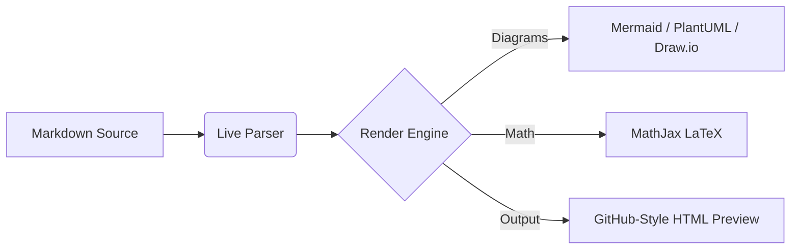
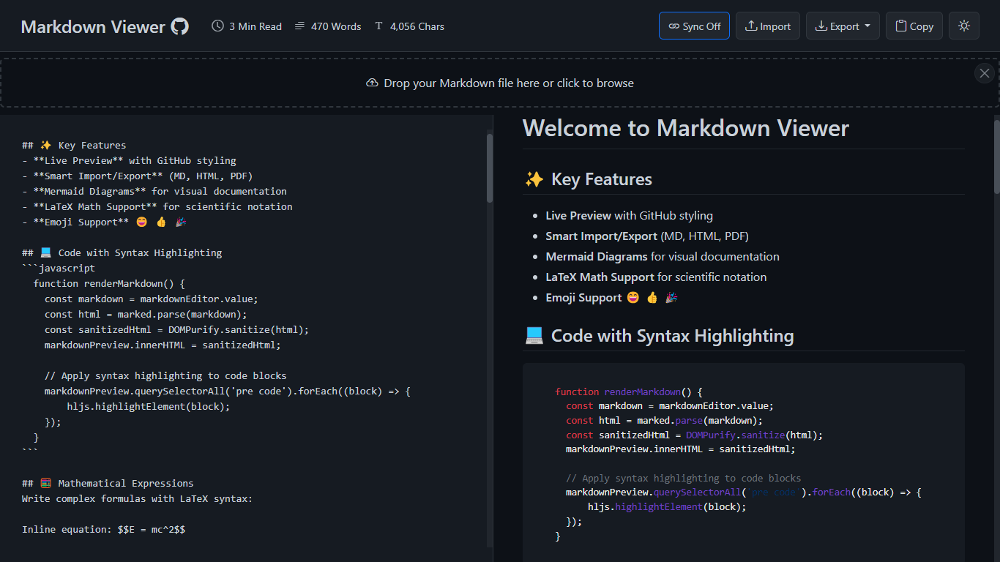
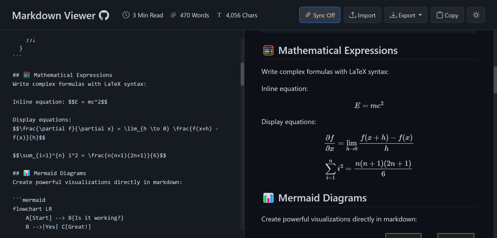
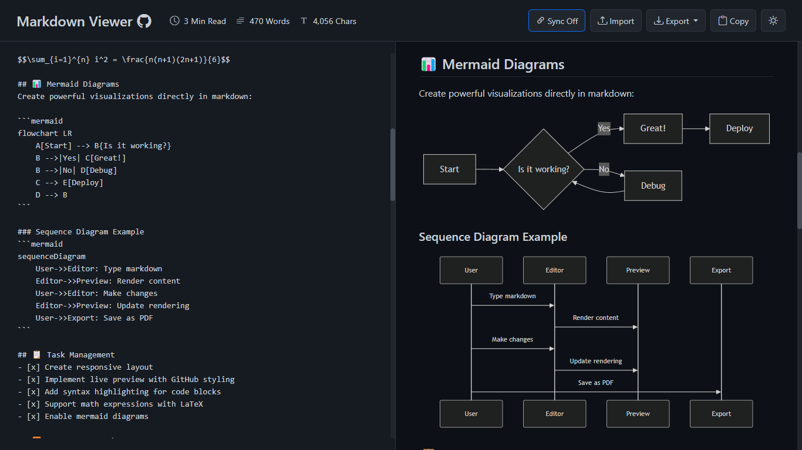
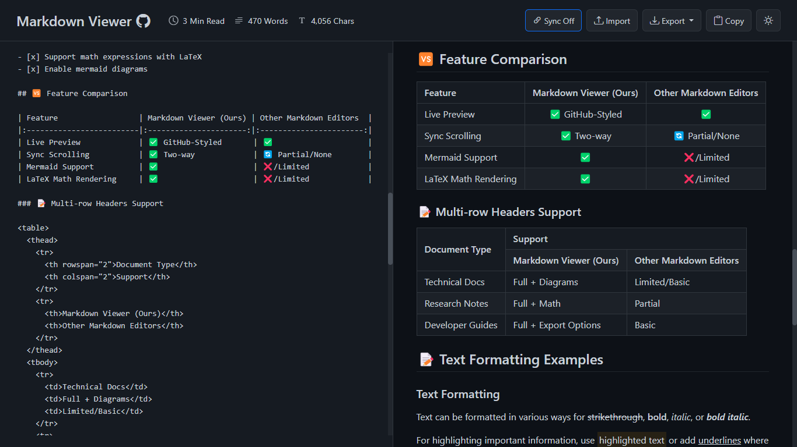

# 2ndBrain (MD Preview) 🧠

<div align="center">
  
  <h2 align="center">Next-Generation Client-Side Markdown Editor & Personal Assistant</h2>
  <p align="center">
    <strong>Fast, private, and feature-rich — running 100% in your browser with zero backend.</strong>
  </p>

  <p align="center">
    <a href="https://md.khanhdp.com"></a>
    <a href="LICENSE"></a>
    
    
  </p>

  <p align="center">
    <a href="#-overview">Overview</a> •
    <a href="#-key-features">Key Features</a> •
    <a href="#-diagrams--math">Diagrams & Math</a> •
    <a href="#-screenshots">Screenshots</a> •
    <a href="#-keyboard-shortcuts">Shortcuts</a> •
    <a href="#-getting-started">Getting Started</a> •
    <a href="#-license">License</a>
  </p>
</div>

---

## 🚀 Overview

**2ndBrain** (MD Preview) is a modern, privacy-first Markdown workspace engineered for developers, researchers, and technical writers. It brings GitHub-flavored Markdown rendering, multi-tab file management, Chrome-style tab grouping, local directory vault sync, and comprehensive diagramming tools into a clean, glassmorphism-styled interface.

- 🔒 **Zero-Knowledge Privacy**: 100% client-side execution. All notes, histories, and settings remain on your local machine using browser `IndexedDB` (via `localforage`) and `localStorage`. No accounts, no database, no third-party tracking.
- ⚡ **Blazing Fast**: Powered by Vite and vanilla ES modules with instant live preview.
- 🌐 **Online or Offline**: Installable as a PWA, usable as a Chrome Extension with Side Panel support, or downloadable as a standalone self-contained `.html` file.

---

## ✨ Key Features

### 📑 Multi-Tab Workspace
- **Dynamic Tabs**: Create unlimited notes with drag-and-drop tab reordering.
- **Smart Auto-Naming**: Automatically detects and renames untitled notes from the first H1, H2, frontmatter title, or first sentence.
- **Inline Renaming**: Double-click any tab title or use the context menu to rename immediately.
- **Tab Pinning & Tags**: Pin critical notes to the front with visual indicators, or assign customizable tags to filter notes with one click.

### 🎨 Chrome-Style Tab Groups
- Organize workspaces into color-coded groups (8 vibrant colors: gray, blue, purple, green, yellow, orange, red, pink).
- **Collapsible**: Click group headers to collapse or expand related documents.
- **Interactive**: Drag tabs directly into groups, rename groups inline, and duplicate tabs with preserved group hierarchy.

### 📂 Local Directory Vault Sync
- Connect a local directory directly through the browser using the **Native File System Access API**.
- Browse folders and files via the integrated Explorer sidebar.
- Seamlessly synchronize virtual browser tabs directly into your local directory.

### 👁️ Responsive Split-Screen & Focus Mode
- Toggle between **Editor**, **Split**, and **Preview** modes effortlessly.
- **Synchronized Scrolling**: Smooth two-way scroll lock between editor and rendered output.
- **Hide / Focus Mode**: Collapse headers and chrome at the touch of a button (`Escape` or toggle button) for a completely distraction-free writing environment.

### 🔍 Instant Full-Text Search (`Cmd/Ctrl + K`)
- High-performance full-text search indexing across all active and cached notes powered by `minisearch`.
- Instant search modal with keyboard navigation (`↑`/`↓`/`Enter`), keyword highlighting, and direct jump-to-anchor with pulse highlighting in preview.

### 🕒 Version History & Visual Diff
- Slide-in version history sidebar with adjustable width.
- **Auto-Snapshots**: Automatic incremental snapshots saved every few seconds when content changes, and whenever sharing notes.
- **Visual Diff Viewer**: Interactive unified diff view powered by `diff` to track additions, deletions, and revisions over time.

### 🎨 Curated Document Themes
Switch document aesthetics on the fly:
- **Classic & Reading**: Default (GitHub), Academic (Serif), Typewriter, Newspaper, Manuscript.
- **Modern & Technical**: Business (Corporate), Minimal, Hacker (Terminal).
- **Vibrant**: Ocean, Sunset, Rainbow.
- **System Theme**: Seamless toggle between Dark and Light glassmorphism themes.

### 💾 Export & Sharing
- **Multi-Format Export**: Save as raw Markdown (`.md`), styled HTML, or paginated PDF.
- **Download Single File (.html)**: Package the entire web application and your document into a single self-contained offline HTML file.
- **Backup & Restore**: Export your complete workspace state as a single JSON file and restore anytime.
- **Zero-Backend URL Sharing**: Share notes instantly via compressed, URL-safe hash URLs with custom read-only and focus mode parameters.

---

## 📊 Diagrams & Math

2ndBrain supports rich visual documentation directly within standard Markdown code blocks:

### 1. Mermaid.js
Render flowcharts, sequence diagrams, class diagrams, state diagrams, Gantt charts, and Git graphs:



> **Interactive Diagram Toolbar**: Hover over any Mermaid diagram to reveal controls:
> - ⛶ **Pan & Zoom Modal**: Interactive drag-to-pan, mouse-wheel zoom, and reset.
> - 📷 **PNG / SVG Download**: One-click high-resolution export.
> - 📋 **Copy to Clipboard**: Instant image copy to paste directly into Slack, Notion, or Docs.

### 2. PlantUML & Draw.io
- **PlantUML**: Automatically encoded and rendered via client-side SVG transformation.
- **Draw.io**: Seamlessly preview XML-based Draw.io diagrams natively in the preview pane.

### 3. LaTeX Math via MathJax
Write inline formulas with `$...$` or complex display blocks with `$$...$$`:

$$\frac{\partial f}{\partial x} = \lim_{h \to 0} \frac{f(x+h) - f(x)}{h}$$

$$\sum_{i=1}^{n} i^2 = \frac{n(n+1)(2n+1)}{6}$$

---

## 📸 Screenshots

| Code Syntax Highlighting | Mathematical Expressions |
| :---: | :---: |
|  |  |

| Mermaid Diagrams | Tables & Layouts |
| :---: | :---: |
|  |  |

---

## ⌨️ Keyboard Shortcuts

| Shortcut | Action |
| --- | --- |
| <kbd>Cmd</kbd> / <kbd>Ctrl</kbd> + <kbd>K</kbd> | Open Full-Text Search Modal |
| <kbd>Cmd</kbd> / <kbd>Ctrl</kbd> + <kbd>B</kbd> | Bold selected text |
| <kbd>Cmd</kbd> / <kbd>Ctrl</kbd> + <kbd>I</kbd> | Italicize selected text |
| <kbd>Cmd</kbd> / <kbd>Ctrl</kbd> + <kbd>S</kbd> | Quick Save / Export Markdown |
| <kbd>Escape</kbd> | Close search / history / diagram modal or exit Focus Mode |

---

## 🧩 Chrome Extension (Manifest V3)

2ndBrain can be loaded as an unpacked Chrome Extension with Side Panel support:

1. Build the production bundle:
   ```bash
   npm run build
   ```
2. Open Google Chrome and navigate to `chrome://extensions/`.
3. Enable **Developer mode** (top right switch).
4. Click **Load unpacked** and select the [`dist/`](dist/) directory.
5. Click the extension icon to launch 2ndBrain in the Chrome Side Panel.

---

## 🛠️ Getting Started

### Prerequisites
- Node.js (v18 or higher recommended)
- npm or pnpm

### Installation & Setup

1. **Clone the repository:**
   ```bash
   git clone https://github.com/khanhduong22/md-preview.git
   cd md-preview
   ```

2. **Install dependencies:**
   ```bash
   npm install
   ```

3. **Start local development server:**
   ```bash
   npm run dev
   ```
   Open your browser at `http://localhost:5173`.

4. **Build production assets:**
   ```bash
   npm run build
   ```

5. **Run Playwright test suite:**
   ```bash
   npx playwright test
   ```

---

## 📄 License

This project is licensed under the MIT License — see the [LICENSE](LICENSE) file for details.

---

<div align="center">
  <p>Crafted with ❤️ by <a href="https://github.com/khanhduong22">KhanhDP</a></p>
  <p><a href="https://md.khanhdp.com">md.khanhdp.com</a></p>
</div>
