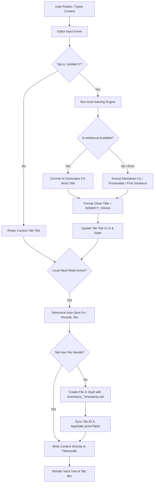

# Technical Design: Auto-Save Engine & AI-Fallback Smart Naming

## Architecture Overview

## Component Architecture

1. **Auto-Naming Module (`src/utils/autoname.js`)**:
   - `extractMarkdownTitle(content)`: Parses YAML `title:`, markdown `# Heading`, `## Heading`, or extracts the first meaningful non-empty line (truncated to 36 chars, sanitized).
   - `generateDocumentTitle(content)`: Async function that attempts `window.ai.languageModel.create()` or `window.ai.summarizer` if present, with instantaneous heuristic fallback.
   - `getFormattedTimestamp(date)`: Formats dates to `DDMMYY_HHmm` (e.g. `240826_1120`).
   - `sanitizeFileName(name)`: Strips invalid OS characters (`/ \ : * ? " < > |`) while preserving unicode/Vietnamese characters.

2. **Auto-Save Engine (`src/core/autosave.js`)**:
   - `initAutoSave()`: Listens for dirty tabs and runs periodic / debounced flushes.
   - `saveVirtualTabToVault(tab, content)`:
     - Derives sanitized name with timestamp suffix if untitled or duplicate.
     - Acquires `fileHandle` via `AppState.vaultDirHandle.getFileHandle(safeName, { create: true })`.
     - Assigns `tab.handle = fileHandle`, `tab.id = AppState.vaultDirHandle.name + '/' + safeName`.
     - **CRITICAL SYNC**: Synchronizes `AppState.activeTabId = tab.id`, `saveActiveTabId(tab.id)`, and writes content directly to file handle.
     - Calls `renderVaultTree()` and `renderTabBar(AppState.tabs, AppState.activeTabId)`.

3. **Editor Integration (`src/core/editor.js`)**:
   - When editor receives input in an `Untitled` tab and content changes from empty to populated:
     - Triggers title extraction and tab rename.
     - Queues debounced auto-save (5s) when in Local Vault mode.
